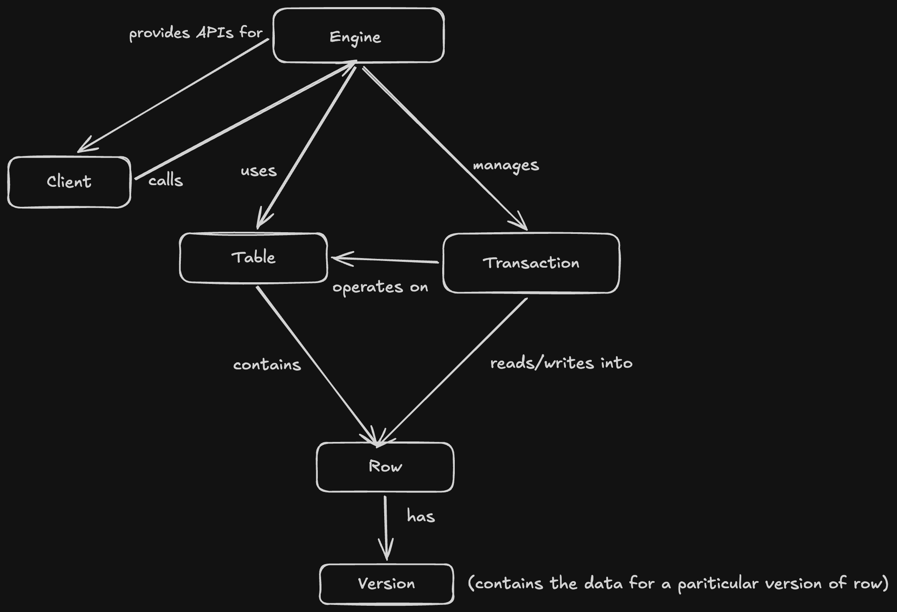

# MVCC DB

`mvcc-db` is a small C++17 prototype of a multi-version concurrency control database. It currently demonstrates:

- transaction begin / commit / rollback
- snapshot-style read visibility
- version chains per row
- basic insert, update, and delete operations

## Architecture

The project is organized around a simple engine/table/transaction split:

- `Engine` exposes the public API and manages transaction state
- `Table` stores rows and their versions
- `Transaction` tracks begin and commit timestamps
- `Version` stores the row data plus creation and deletion metadata



## Project Layout

- `src/main.cpp` - smoke test for the MVCC behavior
- `src/engine/engine.cpp` - transaction handling and visibility rules
- `src/storage/table.cpp` - versioned row storage
- `src/transaction/transaction.cpp` - transaction type implementation
- `src/utils/logger.cpp` - simple console logger
- `include/` - public headers for the core components

## Build

```bash
cmake -S . -B build
cmake --build build
```

## Run

```bash
./build/mvcc-db
```

The sample program exercises:

- reading your own writes
- snapshot visibility across transactions
- rollback of an update
- rollback of a delete

## Notes

This is a learning-oriented MVCC implementation, not a production storage engine. It does not yet include locking, conflict detection, persistence, or recovery.
